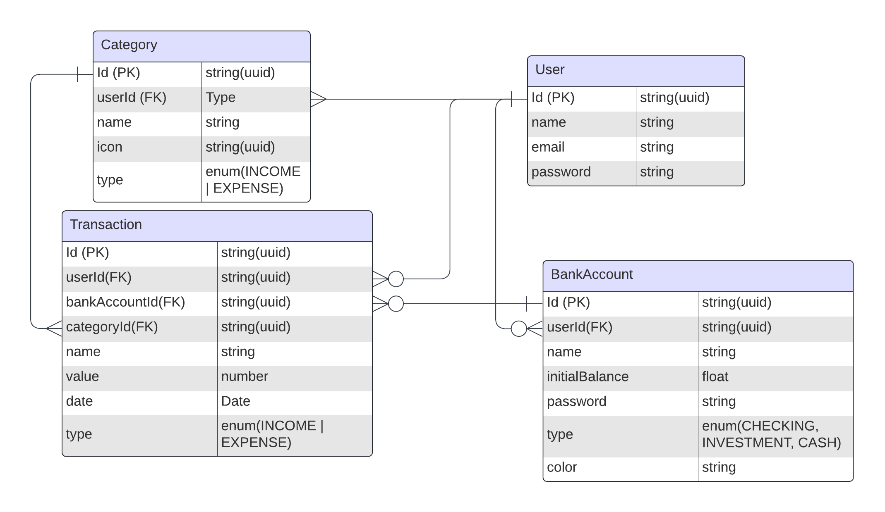

## Description
"
[Nest](https://github.com/nestjs/nest) and [Prisma](https://www.prisma.io/) API repository for the FINCHECK project.

## Installation

```bash
$ yarn install
```

## Running the app

```bash
# development
$ yarn run start

# watch mode
$ yarn run start:dev

# production mode
$ yarn run start:prod
```

## Database

